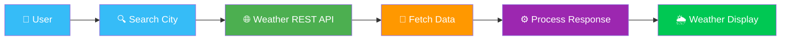

<div align="center">

# 🌦️ Weather Forecast Application

### ✨ Real-Time Weather Information at Your Fingertips


<p>
  
</p>

<p>
  
  
  
  
</p>

<br>

<p>
  <a href="YOUR_LIVE_DEMO_LINK">
    
  </a>
  &nbsp;
  <a href="YOUR_GITHUB_LINK">
    
  </a>
</p>

<br>


</div>

---

<div align="center">

## 🌤️ About The Project

</div>

<table align="center">
<tr>
<td>

**Weather Forecast Application** is a modern and responsive web application that provides **real-time weather information** for any city around the world.

<br>

The application uses a **Weather REST API** to fetch live weather data and displays important information such as:

<br>

🌡️ **Temperature**   •  
💧 **Humidity**   •  
💨 **Wind Speed**   •  
☁️ **Weather Conditions**

<br><br>

All information is presented through a **clean, modern and user-friendly interface**.

</td>
</tr>
</table>

---

<div align="center">

## ✨ Features

<br>

<table>
<tr>

<td align="center" width="33%">

### 🔍

### Smart City Search

Search weather information by entering any city name.

</td>

<td align="center" width="33%">

### 🌡️

### Live Temperature

Get real-time temperature information.

</td>

<td align="center" width="33%">

### 💧

### Humidity Details

View current humidity levels.

</td>

</tr>

<tr>

<td align="center">

### 💨

### Wind Information

Check current wind speed.

</td>

<td align="center">

### ☁️

### Weather Conditions

Display current weather conditions with icons.

</td>

<td align="center">

### 📱

### Responsive Design

Works smoothly on desktop, tablet and mobile devices.

</td>

</tr>
</table>

</div>

---

<div align="center">

## 🎨 UI Highlights

<br>

<table>
<tr>
<td align="center">✨<br><b>Modern & Clean Interface</b></td>
<td align="center">🌈<br><b>Beautiful Animated Background</b></td>
<td align="center">🪟<br><b>Glassmorphism Design</b></td>
</tr>

<tr>
<td align="center">⚡<br><b>Smooth Hover Animations</b></td>
<td align="center">📱<br><b>Fully Responsive Layout</b></td>
<td align="center">🌤️<br><b>Dynamic Weather Icons</b></td>
</tr>

<tr>
<td align="center">🚨<br><b>User-Friendly Errors</b></td>
<td align="center">🔄<br><b>Dynamic Data Updates</b></td>
<td align="center">💎<br><b>Modern Visual Experience</b></td>
</tr>
</table>

</div>

---

<div align="center">

## 🛠️ Tech Stack

<br>

<table>
<tr>
<th>Technology</th>
<th>Purpose</th>
</tr>

<tr>
<td align="center">🟧 <b>HTML5</b></td>
<td>Website Structure</td>
</tr>

<tr>
<td align="center">🟦 <b>CSS3</b></td>
<td>Styling & Responsive UI</td>
</tr>

<tr>
<td align="center">🟨 <b>JavaScript</b></td>
<td>Application Logic</td>
</tr>

<tr>
<td align="center">🌐 <b>REST API</b></td>
<td>Live Weather Data</td>
</tr>

<tr>
<td align="center">🔗 <b>Fetch API</b></td>
<td>API Integration</td>
</tr>

</table>

</div>

---

<div align="center">

## 📸 Application Preview

<br>


<br><br>

<table>
<tr>
<td>🌤️ Clean UI</td>
<td>⚡ Fast Experience</td>
<td>📱 Responsive</td>
<td>🎨 Modern Design</td>
</tr>
</table>

</div>

---

<div align="center">

## ⚡ How It Works

<br>

```text
             👤 USER
                │
                ▼
         🔍 ENTER CITY
                │
                ▼
        🌐 WEATHER API
                │
                ▼
          📡 FETCH DATA
                │
                ▼
       ⚙️ PROCESS RESPONSE
                │
                ▼
         🌦️ DISPLAY WEATHER
                │
                ▼
       ✨ BEAUTIFUL UI
```

</div>

---

<div align="center">

## 🔄 Weather Data Flow

<br>



</div>

---

<div align="center">

## 🚀 Project Experience

<br>

**🌤️ Real-Time Data**
Live weather information fetched directly from the API.

**🔍 Easy Search**
Simply enter a city name and get instant results.

**🎨 Modern UI**
Clean interface with animations and glassmorphism effects.

**📱 Responsive Experience**
Optimized for desktop, tablet and mobile devices.

</div>

---

<div align="center">

## ⭐ Support

If you like this project, don't forget to:

<br>

⭐ **Star this repository**

🍴 **Fork the project**

📢 **Share it with others**

<br><br>

### 💙 Thanks for visiting!


</div>
