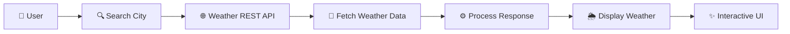

<div align="center">

# 🌦️ Weather Forecast Application

### 🚀 Real-Time Weather • Beautiful UI • Smart Search


<br>


<br><br>


<br><br>

<a href="YOUR_LIVE_DEMO_LINK">

</a>

<a href="YOUR_GITHUB_LINK">

</a>

<br><br>


</div>

---

<div align="center">

## 🌦️ Experience Weather Like Never Before

</div>

> **Weather Forecast Application** is a modern, responsive and interactive web application that delivers **real-time weather information** for cities around the world.

Powered by a **Weather REST API**, the application fetches live weather data and presents it through a clean, attractive and user-friendly interface.

---

## ✨ Features

<div align="center">

|       🔍 Smart Search       |        🌡️ Live Temperature       |
| :-------------------------: | :-------------------------------: |
| Search weather by city name | Get current temperature instantly |

|           💧 Humidity          |          💨 Wind Speed         |
| :----------------------------: | :----------------------------: |
| View real-time humidity levels | Check current wind information |

|        ☁️ Weather Conditions        |        📱 Responsive UI       |
| :---------------------------------: | :---------------------------: |
| Dynamic weather information & icons | Works across all screen sizes |

</div>

---

## 🎨 UI & Animation Highlights

<div align="center">

✨ **Modern Glassmorphism Interface**
🌈 **Animated Gradient Background**
🌤️ **Dynamic Weather Icons**
⚡ **Smooth Hover & Transition Effects**
🔄 **Animated Loading States**
🚨 **Clean Error Handling**
📱 **Mobile-First Responsive Design**

</div>

---

## 🛠️ Tech Stack

<div align="center">

|     Technology    | Usage                                |
| :---------------: | :----------------------------------- |
|    🟧 **HTML5**   | Semantic website structure           |
|    🟦 **CSS3**    | Modern styling & animations          |
| 🟨 **JavaScript** | Application logic & DOM manipulation |
|  🌐 **REST API**  | Fetching live weather data           |
|  🔗 **Fetch API** | API communication                    |

</div>

---

## 📸 Application Preview

<div align="center">


<br><br>

### 🌤️ Clean • Modern • Responsive

</div>

---

## ⚡ How It Works

<div align="center">

```text
                 👤 USER
                   │
                   ▼
            🔍 Enter City Name
                   │
                   ▼
             🌐 Weather API
                   │
                   ▼
              📡 Fetch Data
                   │
                   ▼
            ⚙️ Process Response
                   │
                   ▼
          🌦️ Display Weather
                   │
                   ▼
        ✨ Beautiful UI Experience
```

</div>

---

## 🔄 Application Flow



---

## 🚀 Key Highlights

```diff
+ ⚡ Real-time weather data
+ 🔍 City-based weather search
+ 🌡️ Temperature information
+ 💧 Humidity details
+ 💨 Wind speed information
+ ☁️ Dynamic weather conditions
+ 📱 Fully responsive design
+ 🎨 Modern animated interface
+ 🚨 User-friendly error handling
```

---

## 📂 Project Structure

```text
Weather-Forecast/
│
├── 📄 index.html
├── 🎨 style.css
├── ⚡ script.js
├── 🖼️ assets/
│
└── 📄 README.md
```

---

## 💻 Getting Started

### 1️⃣ Clone the Repository

```bash
git clone YOUR_GITHUB_LINK
```

### 2️⃣ Open Project

```bash
cd Weather-Forecast
```

### 3️⃣ Run the Application

Simply open:

```text
index.html
```

in your browser.

---

## 🌟 Future Enhancements

* 📍 Current Location Weather
* 📅 7-Day Weather Forecast
* 🌙 Dark / Light Mode
* 🌅 Sunrise & Sunset Information
* 🌡️ Feels Like Temperature
* 🗺️ Weather Map Integration
* 📊 Weather Charts & Statistics
* 🎨 More Dynamic Weather Animations

---

## 👨‍💻 Developer

<div align="center">

### **Suryansh Singh**

**Full Stack Developer | AI & ML Enthusiast | Aspiring Software Engineer**

<br>

⭐ If you found this project useful, consider giving it a **Star**!

<br><br>


</div>
